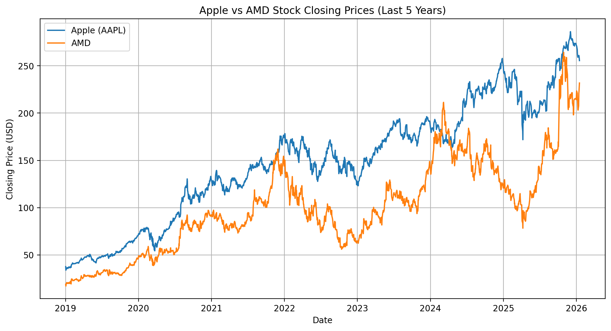

# stock-data-extraction
Extracting stock data using yfinance (Apple &amp; AMD)
## 📈 Apple vs AMD Stock Prices (Last 5 Years)

## 📌 Key Learnings

- Extracted real-time stock data using the yfinance API  
- Worked with pandas DataFrames for historical price analysis  
- Stored and retrieved company metadata using JSON  
- Built comparative visualizations using Matplotlib  
- Documented a reproducible data project on GitHub  
